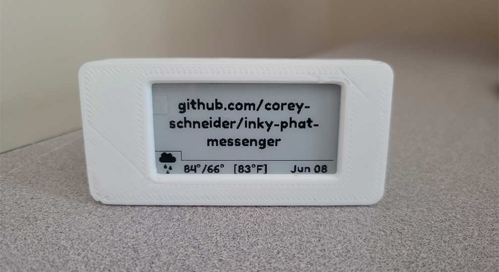

# Inky Messenger 

##### _Send messages to family or loved ones_

_Like the case? Get it from [balenalabs' inkyshot repo](https://github.com/balenalabs/inkyshot/tree/master/assets/case-design2-rear-usb/stl)_

#### Table of Contents
  * [Features](#features)
  * [Hardware](#hardware)
  * [Setup](#setup)
  * [To do](#todo)
  * [Troubleshooting](#troubleshooting)
  * [Credits](#credits)

---

## Features
- Send an ~~email~~ ... ~~text message~~ ... **Discord message** to update the message on the inky phat
  - _Ran into some trouble with different mail servers having different ways of handling message bodies. The Discord bot is cleaner, more stable, and more practical as it can be accessed on [iOS](https://apps.apple.com/us/app/discord-talk-chat-hang-out/id985746746), [Android](https://play.google.com/store/apps/details?id=com.discord&hl=en_US&gl=US), [Windows, Linux, MacOS, Chrome OS, etc.](https://discord.com/)_
- Weather status icon
- Temperature (in Fahrenheit) from OpenWeatherMap API  _(RIP DarkSky)_
- Date in the bottom right corner
- Can send a message up to 4 lines long
- Makes one call to the IpInfo API (unless the device is moved to a different network)
- Logging of errors saved in `log.txt` for easy debugging though sftp if the device suddenly stops working
  - Log will include:
    - Incorrect / invalid email credentials
    - Incorrect / invalid API key
    - Missing email or password in `config.json`
    - Missing API key in `config.json`
    - Missing `config.json`
- Discord commands:
  - `!reboot` - Restarts the Raspberry Pi
  - `!shutdown` - Turns off the Raspberry Pi
  - `any text here` - Sends a message. Usage: `Hello!` will show `Hello!` on the display

## Hardware
- [Raspberry Pi Zero W](https://amzn.to/3q9JLCk) ($17) or [Zero WH](https://amzn.to/2TCGAa7) ($23) with pre-soldered headers // _[Adafruit link](https://www.adafruit.com/product/3708) ($14)_
  - [Break-away 2x20-pin GPIO headers](https://amzn.to/3gt1Mbn) ($5) // _[Adafruit link](https://www.adafruit.com/product/2822) ($0.95)_
  - [Power supply and cable - 5v 3A](https://amzn.to/3iNUnVU) ($7) // _[Adafruit link](https://www.adafruit.com/product/1995) ($7.50)_
- [Pimoroni Inky pHat](https://amzn.to/35AH4jr) ($32.80) // _[Adafruit link](https://www.adafruit.com/product/3934) ($25)_
- [8GB microSD card](https://amzn.to/3wz1ipS) ($5.50)
- [3D printed case](https://github.com/balenalabs/inkyshot/tree/master/assets/case-design2-rear-usb/stl) (free stl; about $5 to print)
- [Micro USB to DIP adapter](https://amzn.to/2S8JT8A) ($4.50)
- [Soldering gun](https://amzn.to/3q0cx8a) ($12) (for the headers and USB DIP adapter)
  - Above link includes the necessary items:
    - Flux paste
    - Solder wire
- [~22 AWG wire](https://amzn.to/3gIcxW6) ($5) (or salvage from something lying around)

## Setup
- Download [Raspberry Pi OS Lite](https://www.raspberrypi.org/software/operating-systems/)
- Flash image to SD card with [Raspberry Pi imager](https://www.raspberrypi.org/software/). While this is happening...
  - Download [wpa_supplicant.conf](wpa_supplicant.conf) and [ssh](ssh)
  - Modify [wpa_supplicant.conf](wpa_supplicant.conf) to include your wifi credentials
- Safely remove and reinsert the microSD card you just flashed
- Put YOUR modified version of `wpa_supplicant.conf` and `ssh` directly onto the root directory of the microSD card
- Insert microSD, plug in the Pi, and SSH into it
- Download the necessary files through `curl https://get.pimoroni.com/inky | bash`
- Enable SPI and I2C. To do this, run `sudo raspi-config`, scroll to Interface Options, and enable them.
  - While in `raspi-config`, change the time zone _(unless you live in the UK)_. Select `Localisation Options` > `Timezone`.
- Run `sudo apt-get update` and `sudo apt-get upgrade` - _This will take a while_
- Run `python3 -m pip install --upgrade pip` and `python3 -m pip install --upgrade Pillow` and `python3 -m pip install discord`
- Run `cd ~` and `git clone https://github.com/corey-schneider/inky-phat-messenger.git` and `cd inky-phat-messenger`
- Create a new (free) account with [OpenWeatherMap.org](https://home.openweathermap.org/users/sign_up).
  - Sign in, click your name in the top right, click `My API keys` and copy the Key to [config/config.json](config/config.json)
- Create Discord bot:
  - Create a Discord account or sign in to your existing account and head to [https://discord.com/developers/applications](https://discord.com/developers/applications)
  - Click `New Application` in the top right and name it `inky`
  - Click `Bot` on the left column and then `Add Bot` on the right
  - Copy your `TOKEN` and be sure not to share it with anyone. Paste it in `config/config.json` in `discord > token`.
    - You may also enter your discord handle there too. _Be sure to include your hash tag and numbers._ This will act as a whitelist, only messages from `discord > allowed_user` will change the message on the inky phat, but you may also leave it blank to allow anyone in the server to change the message
  - Click `OAuth2` on the left column. Under `SCOPES`, check `bot`. Under `BOT PERMISSIONS`, check `Send Messages`, `Manage Messages`, `Read Message History`
  - Copy the link at the bottom of `SCOPES` - it should end with `&scope=bot` - but don't yet go to it
  - Create a new Discord server and name it whatever you'd like, then visit the link copied in the last step and select the server you've just created
    - You may want to create a server icon - there is a Raspberry Pi icon that can be found [here](github-images/rpi-logo.png)
- After testing to make sure everything is working, we need to make sure `discordbot.py` runs on startup and `display.py` runs every hour to update the weather
  - Run `crontab -e`. Type `1` if prompted to select an editor
  - At the bottom of the file, enter these two lines:
    - `@reboot sleep 30; cd /home/pi/inky-phat-messenger && python3 /home/pi/inky-phat-messenger/discordbot.py`
    - `@hourly cd /home/pi/inky-phat-messenger && python3 /home/pi/inky-phat-messenger/display.py`
  - hit `ctrl o`, enter, then `ctrl x`

## TODO
- Clean up README.md
  - Organize `SETUP` into sections
- Use PIL to create a mockup image of the display and have the bot send it over Discord
- Clean up code in `display.py`
  - Separate code into methods and classes
    - Weather can be its own class
  - Integrate `bottom_frame_info` better
    - If false, move text lower or allow for longer messages
  - Vertical align text
  - Remove print alongside logger
  - Change sys.exit(message) to (0)
- Fix logger
  - Should print
- Add more commands to Discord bot
  - font size
  - font style
  - get IP / location / weather information
  - enable / disable bottom frame
  - !help command to show all commands
- Have error messages routed to Discord bot
- Set up alerts on Discord bot
  - Enter the pi holder's Discord handle and alert them when a new message arrives on the inky display
- Add more weather icons
  - Hopefully remove the ugly bump too
  - [Climacons](https://thenounproject.com/adamwhitcroft/collection/climacons/) are really nice!
- Finer detailed weather
- Have discord bot be aware of length of message and reject a message that will overflow off the screen
- `paragraph = textwrap.wrap(message, width=24)` 24 cuts off, may need to lower to 23 - do some testing
- Create method for saving to json
  - "Send your first message via discord" doesn't save to configuration file

## Troubleshooting
- If you see an error saying `File "/home/pi/.local/lib/python3.7/site-packages/PIL/Image.py", line 109, in <module>` or something about `from . import _imaging as core`...
  - Run `sudo rm -rf /home/pi/.local/lib/python3.7/site-packages/PIL/`. If the error persists, notice the directory - you may see `python3.8` or similar - change the `rm -rf` command to the version seen in your error.
- If the Discord bot is showing as offline on the Discord server...
  - Check the connection of the raspberry pi - make sure you can ssh into it
  - Make sure the token is correct and placed in `config/config.json`
  - Check the `log.txt` for an error message from discordbot
- If the Discord bot is not responding, the bot is likely offline and needs to be restarted
- If the Discord bot is saying you're not authorized, make sure you entered your name correctly in `config/config.json`. It should look similar to this: `"allowed_user": "tester#1234"`. _Reminder that this is NOT the bot's name; it is YOUR personal account's name_

## Credits
- [IpInfo] - Turns IP addresses into latitude and longitude coordinates
- [OpenWeatherMap] - Weather API
- [weather-phat.py] - Code pieces and icons from the weather application sample
- [balenalabs/inkyshot] - 3D printed case files

   [weather-phat.py]: <https://github.com/pimoroni/inky/blob/master/examples/phat/weather-phat.py>
   [IpInfo]: <https://ipinfo.io/>
   [OpenWeatherMap]: <https://openweathermap.org/api>
   [balenalabs/inkyshot]: <https://github.com/balenalabs/inkyshot/tree/master/assets/case-design2-rear-usb/stl>

## Donate

Ethereum: `0xbb5f5d978acbde2ec79736cc5398768a35665d42`